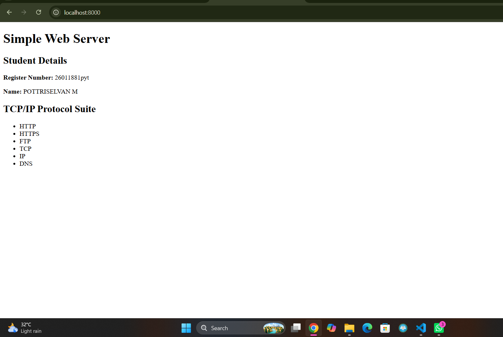
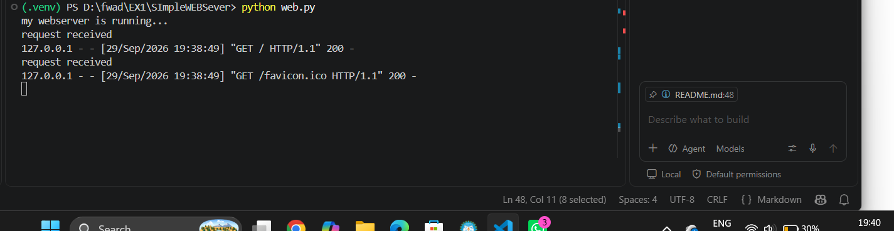

# SImpleWEBSever
# EX01 Developing a Simple Webserver
## Date:29/09/2026

## AIM:
To develop a simple webserver to serve html pages and display the Device Specifications of your Laptop.

## DESIGN STEPS:
### Step 1: 
HTML content creation.

### Step 2:
Design of webserver workflow.

### Step 3:
Implementation using Python code.

### Step 4:
Import the necessary modules.

### Step 5:
Define a custom request handler.

### Step 6:
Start an HTTP server on a specific port.

### Step 7:
Run the Python script to serve web pages.

### Step 8:
Serve the HTML pages.

### Step 9:
Start the server script and check for errors.

### Step 10:
Open a browser and navigate to http://127.0.0.1:8000 (or the assigned port).

## PROGRAM:
```py
from http.server import HTTPServer, BaseHTTPRequestHandler

content = """
<!DOCTYPE html>
<!DOCTYPE html>
<html>
<head>
    <title>Simple Web Server</title>
</head>

<body>
    <h1>Simple Web Server</h1>

    <h2>Student Details</h2>

    <p><b>Register Number:</b> 26011881pyt </p>
    <p><b>Name:</b> POTTRISELVAN M</p>

    <h2>TCP/IP Protocol Suite</h2>

    <ul>
        <li>HTTP</li>
        <li>HTTPS</li>
        <li>FTP</li>
        <li>TCP</li>
        <li>IP</li>
        <li>DNS</li>
    </ul>

</body>
</html>
"""

class myhandler(BaseHTTPRequestHandler):
    def do_GET(self):
        print("request received")
        self.send_response(200)
        self.send_header("content-type", "text/html; charset=utf-8")
        self.end_headers()
        self.wfile.write(content.encode())

server_address = ("", 8000)
httpd = HTTPServer(server_address, myhandler)
print("my webserver is running...")
httpd.serve_forever()


```


## OUTPUT:





## RESULT:
The program for implementing simple webserver is executed successfully.
